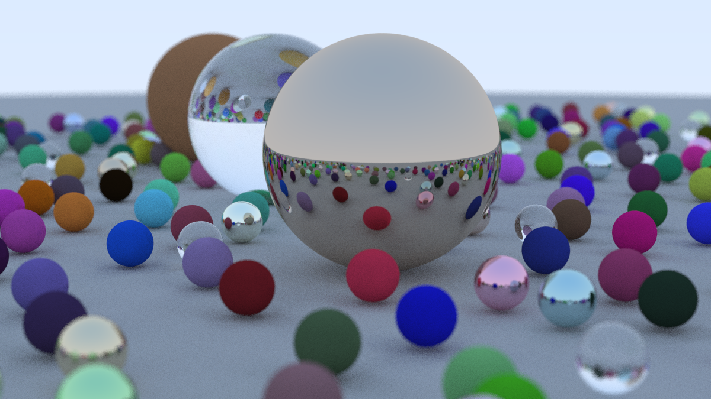

## Ray tracing in one weekend. Rust edition

This is my personal implementation of [Peter Shirley's "Ray Tracing In One Weekend"](https://raytracing.github.io/books/RayTracingInOneWeekend.html) book in Rust.

This project has been developed like a toy project to learn the Rust language. The coding style is not perfect and a lot of Rust features may have not been applied.

The repository history includes a commit per book chapter. In this way, each step can be compiled independently to generate the rendered image for each chapter.

In future revisions, coding refactoring will be applied to improve the coding style and apply Rust features to optimize all computations.

### Dependencies

The current implementation only requires the following crates:
- [fastrand](https://crates.io/crates/fastrand)
- [image](https://crates.io/crates/image)
